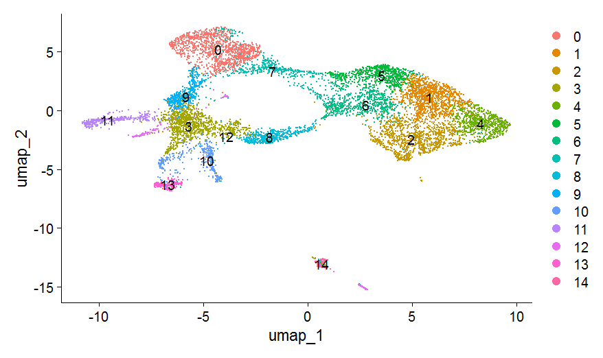
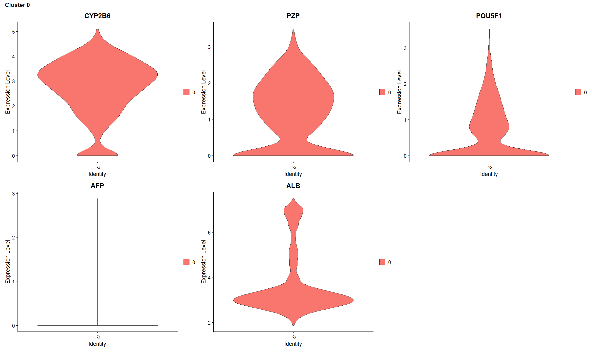
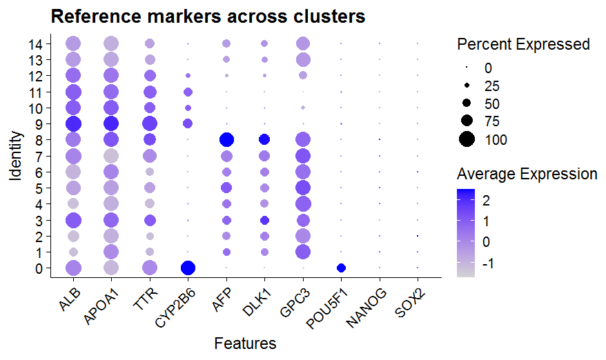
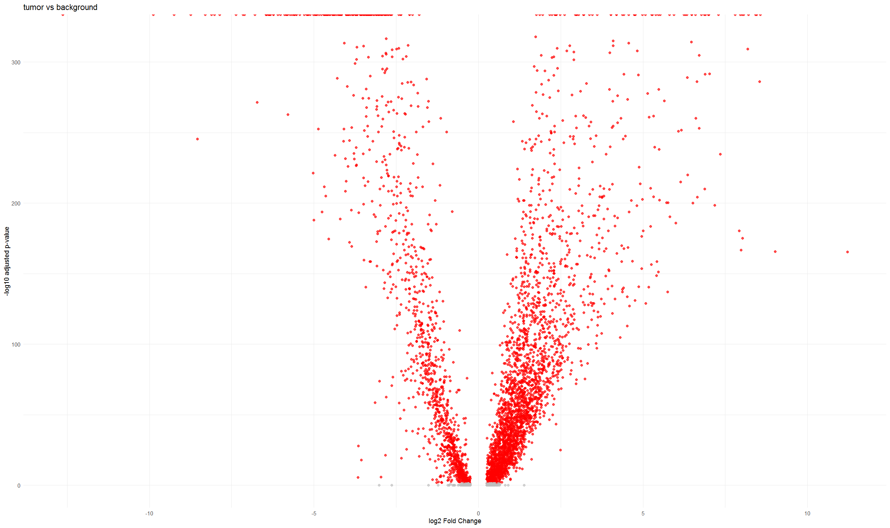
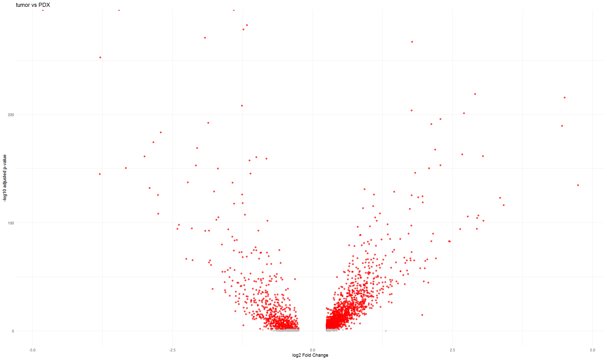
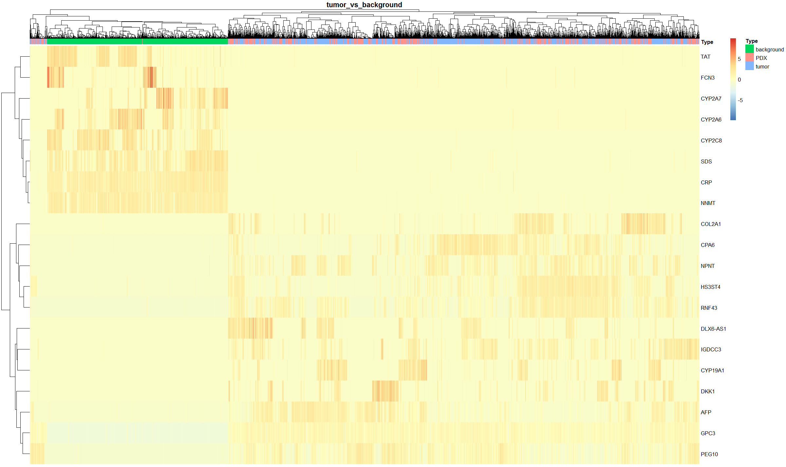

#  Integrated scRNA-seq Analysis of Hepatoblastoma: Tumor, Background, and PDX

This project contains a full analysis workflow for scRNA-seq data using Seurat, including integration, clustering, differential expression (DE) analysis, visualization, and GO enrichment.

---

## Table of Contents
1.  [Scripts]
2. [Data Integration & Clustering](#-1-data-integration--clustering)  
3. [Marker Gene Visualization](#-2-marker-gene-visualization)  
4. [Differential Expression (DE) Analysis](#-3-differential-expression-de-analysis)  
5. [Heatmaps of Top DE Genes](#-4-heatmaps-of-top-de-genes)  
6. [GO Enrichment Analysis](#-5-go-enrichment-analysis-biological-processes)
7. [Integration & Clustring](#scripts/Integrate_ScRNA-Seq)
8. [Visualization Plots](#scripts/visualization_plots)
9. [Functional Insights from GO Enrichment](#Functional_Insights_from_GO_Enrichment)
10. [Biological Summary](#Biological_Summary)

---
## 1. Scripts
- [Integration & Clustering](scripts/Integrate_ScRNA-Seq.R)  
- [Visualization Plots](scripts/visualization_plots.R)

## 2. Data Integration & Clustering
- Samples (Patients + Types) were integrated using Seurat’s integration pipeline.  
- Batch effect (patient effect) was regressed out.  
- UMAP visualization of clusters and sample grouping.  

 Example:

  

---

## 3. Marker Gene Visualization
- FeaturePlot and ViolinPlot were used for selected marker genes (CYP2B6, PZP, POU5F1, AFP, ALB).  
- DotPlot was generated to compare reference markers across clusters.  

 Examples:

  
  

---

## 4. Differential Expression (DE) Analysis
Main pairwise comparisons:
- Tumor vs Background  
- Tumor vs PDX  
- PDX vs Background  

For each comparison:
- DE was performed using FindMarkers (Wilcoxon test, patient effect controlled).  
- Results saved as CSV files (DE_<comparison>.csv).  

 Example Volcano plots:

  
  

---

## 5. Heatmaps of Top DE Genes
- Selected Top 20 DE genes (based on |log2FC|) for each comparison.  
- Heatmaps generated with sample annotation by Type.  

 Example:

---
## 6. GO Enrichment Analysis (Biological Processes)
- Performed separately for Upregulated and Downregulated genes.  
- Enrichment done with clusterProfiler::enrichGO.  

Outputs include:
- DotPlot PDFs (GO_<comp>_Up_dotplot.pdf, GO_<comp>_Down_dotplot.pdf)  
- CSV files with enrichment results (GO_<comp>_Up_enrichment.csv)  

 Example DotPlots (PDF links):  

Tumor vs Background
- [Upregulated](results/enrichment/GO_tumor_vs_background_Up_dotplot.pdf)  
- [Downregulated](results/enrichment/GO_tumor_vs_background_Down_dotplot.pdf)  

Tumor vs PDX
- [Upregulated](results/enrichment/GO_tumor_vs_PDX_Up_dotplot.pdf)  
- [Downregulated](results/enrichment/GO_tumor_vs_PDX_Down_dotplot.pdf)  

PDX vs Background
- [Upregulated](results/enrichment/GO_PDX_vs_background_Up_dotplot.pdf)  
- [Downregulated](results/enrichment/GO_PDX_vs_background_Down_dotplot.pdf)

## Functional Insights from GO Enrichment

The following table summarizes the main upregulated (↑) and downregulated (↓) biological processes across comparisons:

| Comparison          | ↑ Upregulated (Biological processes)                                           | ↓ Downregulated (Biological processes)                                         |
|---------------------|-------------------------------------------------------------------------------|-------------------------------------------------------------------------------|
| PDX vs Background | - Wound healing, lipid transport    - Actin cytoskeleton regulation        | - Steroid & fatty acid metabolism    - Xenobiotic response (detoxification) |
| Tumor vs Background | - Small GTPase signaling, actin cytoskeleton regulation   - Neuron projection & cell size regulation | - Lipid & organic acid catabolism    - Response to xenobiotics              |
| Tumor vs PDX      | - Small GTPase signaling, dendrite morphogenesis   - Sulfur/organic acid biosynthesis | - Ribosome biogenesis & protein folding   - Telomere maintenance regulation |

---

## Biological Summary
- Tumors → stronger signaling & structural reorganization, but lower proteostasis and metabolic breakdown.  
- PDX models → maintain ribosome/protein folding activity, but lose xenobiotic & metabolic diversity.  
- Background tissues → enriched in metabolic and detoxification pathways compared to both PDX and tumor.

